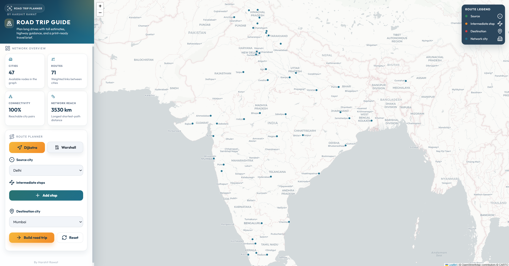
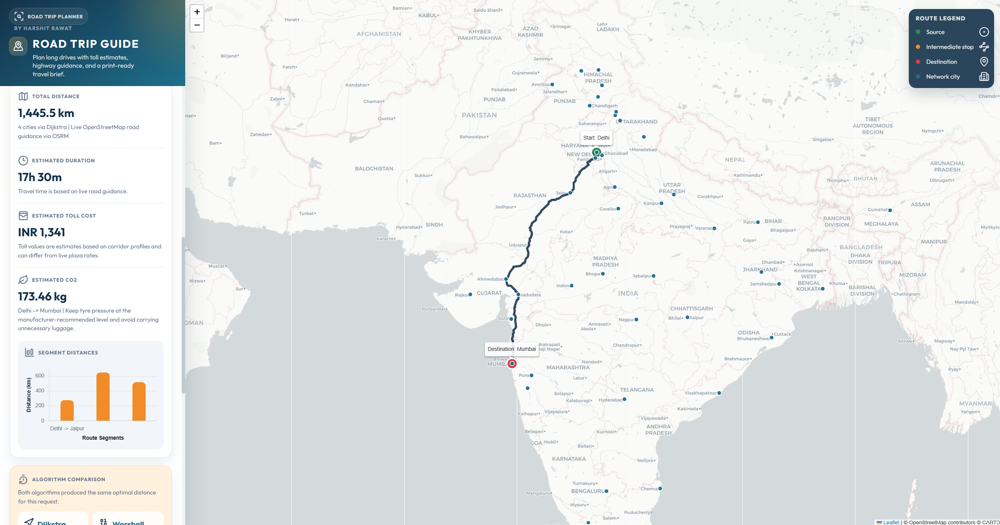
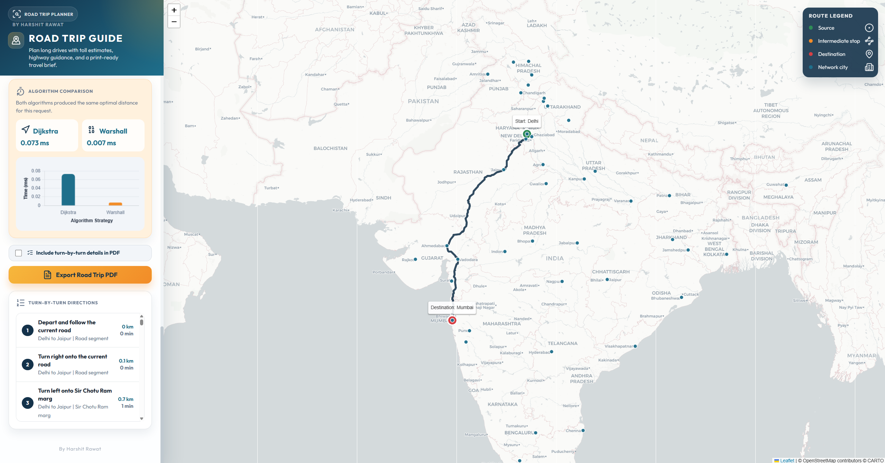
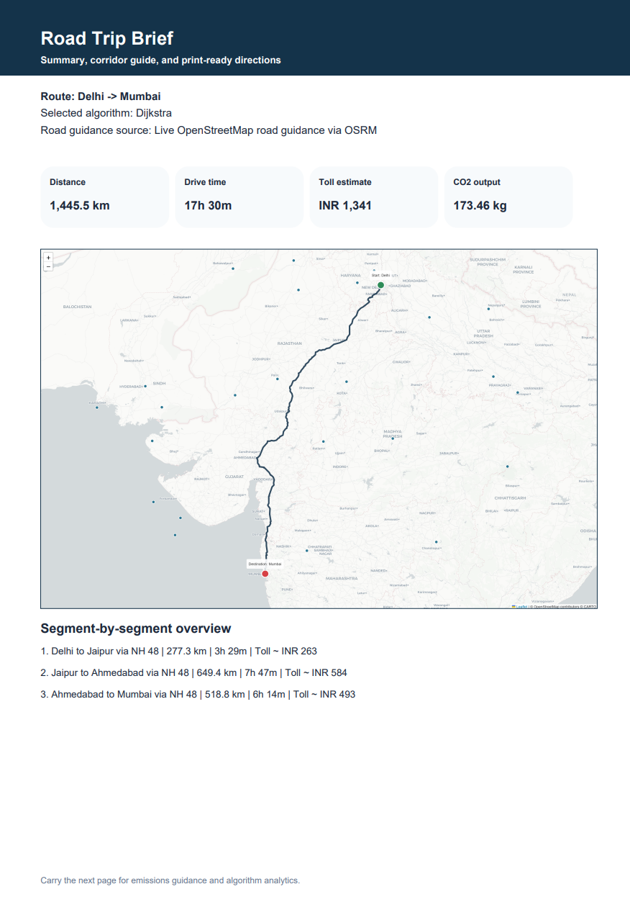
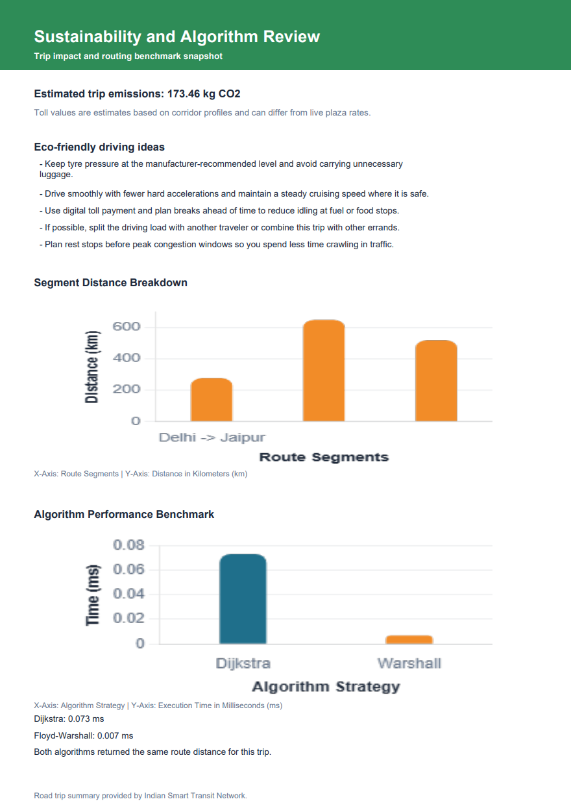

# 🗺️ Road Trip Planner India

🚗 **Smart Route Optimization & Network Analysis System**

[](https://www.python.org/)
[](https://flask.palletsprojects.com/)
[](https://opensource.org/licenses/MIT)

A production-grade road trip planning application designed for the Indian transit network. This system combines **Discrete Mathematics** principles with modern web technologies to provide real-time route optimization, network health diagnostics, and environment-aware travel analytics.

---

## 📸 Product Highlights

<div align="center">
  
</div>

<br />

<div align="center">
  
  
</div>

<br />

<div align="center">
  
  
</div>

---

## 🚀 Core Features

- 🗺️ **Interactive Transit Map**: High-fidelity Leaflet.js integration with live Indian city nodes.
- 🛣️ **Multi-Stop Route Planning**: Add intermediate waypoints to construct complex journey corridors.
- ⚡ **Dual-Engine Pathfinding**: Compare Dijkstra’s Algorithm (Single-Source) vs. Floyd-Warshall (All-Pairs) in real-time.
- 📊 **Dynamic Analytics**: Automated calculations for:
  - Total Distance & Drive Time
  - Intelligent Toll Estimation
  - Carbon Footprint (CO2 Emissions) Analysis
- 🌱 **Eco-Aware Intelligence**: Per-city environmental tips and green driving recommendations.
- 📥 **Professional Export**: Generate print-ready PDF travel briefs with turn-by-turn guidance and segment charts.

---

## 🎓 Discrete Mathematics Foundations

This project serves as a practical implementation of fundamental Graph Theory and Network Analysis principles:

- **Graph Representation**: Modeling the Indian transit network as a weighted undirected graph $G = (V, E)$.
- **Shortest Path Optimization**: 
  - **Dijkstra’s Algorithm**: Used for real-time compute of the single-source shortest path between waypoints.
  - **Floyd-Warshall Algorithm**: Implemented for all-pairs shortest path analysis to derive global network metrics.
- **Network Metrics**:
  - **Graph Diameter**: Identifying the longest "shortest-path" in the connectivity matrix.
  - **Edge Connectivity**: Analyzing the density and robustness of the transit links.
  - **Vertex Reachability**: Ensuring 100% network connectivity across major Indian hubs.

---

## 🛠️ Tech Stack

- **Backend**: Python 3.x, Flask (RESTful API Service)
- **Frontend**: HTML5, Vanilla CSS3 (Custom Glassmorphic Design System), JavaScript (ES6+)
- **Mapping**: Leaflet.js, CARTO Basemaps
- **Visualization**: Chart.js (Route breakdowns & Algorithm benchmarks)
- **Reporting**: jsPDF, html2canvas (PDF Engine)
- **Routing Data**: OSRM API (Live road geometry & guidance)

---

## ⚙️ How to Run

### 1. Clone & Setup
```bash
git clone https://github.com/yourusername/road-trip-planner-india.git
cd road-trip-planner-india
```

### 2. Install Dependencies
```bash
pip install -r requirements.txt
```

### 3. Launch the Application
You can use the provided batch script for quick startup:
```bash
run.bat
```
Or run manually:
```bash
python app.py
```

### 4. Access the Dashboard
Open your browser and navigate to:
**`http://127.0.0.1:5000/`**

---

## 📁 Project Structure

```text
road-trip-planner-india/
├── app.py                  # Flask Backend & API Logic
├── requirements.txt         # Dependency Manifest
├── run.bat                 # Quick-start script
├── README.md               # Product Documentation
├── .gitignore              # Git exclusion rules
│
├── templates/
│   └── index.html          # Modular Frontend Application
│
└── assets/
    └── screenshots/        # Visual documentation assets
        ├── Front_page.png
        ├── Build.png
        ├── Build_2.png
        ├── pdf1.png
        └── pdf2.png
```

---

## 👤 Author

**Harshit Rawat**

Discrete Mathematics Mini Project | CODEX-AG Overhaul

---
<div align="center">
  Made with ❤️ for the Indian Smart Transit Network
</div>
